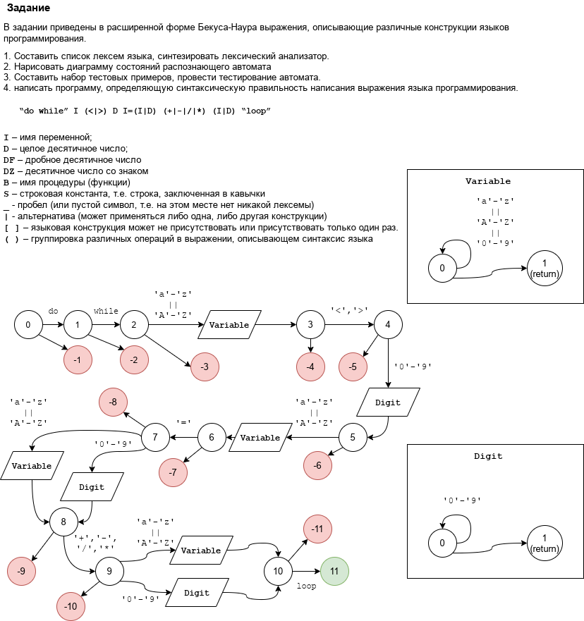

# Finite state machine 

This is little homework done at 3rd course of Higher School. Also it has a few extra challenges I decided to implement for extra mark and demonstration of basic OOP.

## Task

Write finite-state machine to check if statement is valid for template.

for my variant template is 

`"do while" I (<|>) D I=(I|D) (+|-|/|*) (I|D) "loop"`

Where:

```
I - variable name (arbitrary)
D - integer digit
| - alternative separator
( ) - grouped alternates
```

### Full task and scheme for state machine (sorry for russian) 


## Extra challenges

* Make possible to expand state machine for any task
* Implement support sub state machines
* Make error handling

## Implementation

Base interface for state machines is implemented in [IFSM.H](IFSM.h) as templated abstract class. As arguments template take ContaineType which iterate to (it has to have implemented `ContainerType::std_iterator`) and Return_t type that checked at each step and returns at the end of proccessing. Also there is defined initialization of FSM, reseting FSM, public method for iterate through container (either with implicit and explicit `ContainerType::begin()/end()`) and functions for end iterating. Method for logic in iterating step is declared as abstract method `m_procces(ContainerType::std_iterator`).

For error handling additional function can be defined where end state checked (in my case it `MainFSM::print_result()`)

For my task there are [IntegerFSM.h](IntegerFSM.h) [VariableFSM.h](VariableFSM.h) (sub FSMs) and [MainFSM.h](MainFSM.h).
